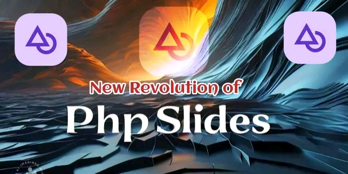

# 
PhpSlides

  

 

## Introduction

PhpSlides is a lightweight, easy-to-use full-stack framework that helps you build web applications quickly and efficiently.
It follows the MVC architectural pattern, separating the application logic into models, views, and controllers to promote code organization and reusability.

Additionally, it provides the capability to write HTML, CSS, and JavaScript in a PHP-like way, making it easier to manage and maintain your front-end and back-end code together.

## Features

- **Full-Stack Development**: Seamlessly integrate front-end and back-end development by writing HTML, CSS, and JavaScript in a PHP-like syntax.
- **Simple Routing**: Easily define routes and map them to controllers and actions.
- **Modular Structure**: Organized directory structure for models, views, controllers, and other components.
- **Database Abstraction**: Simple and flexible database handling with a query builder.
- **Middleware Support**: Add middleware to handle authentication, logging, and other tasks.
- **Event Handling**: Built-in event handling system for managing application events.
- **Service Providers**: Easily manage and configure services like email, payment, caching, etc.
